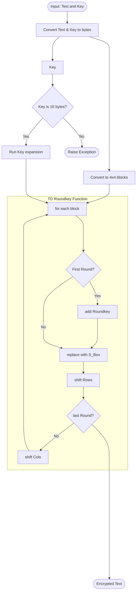

# AES-TuBi-ZiRo-MaUn

Diese AES Verschlüsselung sollte **NICHT** verwendet werden.

# Dependencies installieren

Ist das Repo gekloned, kann mit folgenden Befehl, die benötigten Dependencies installiert werden:

```bash
pip install -r requirements.txt
```

## Requirements.txt aktualisieren

Nach der Installation einer Depedency kann mittels `pipreqs`, das `requirements.txt` neu generiert werden.

`pipreqs` installieren:
```bash
pip install pipreqs
```

`requirements.txt` neugenerieren:
```bash
pipreqs --encoding=utf8 --ignore .venv --force ./
```


## Flowchart AES Encryption
