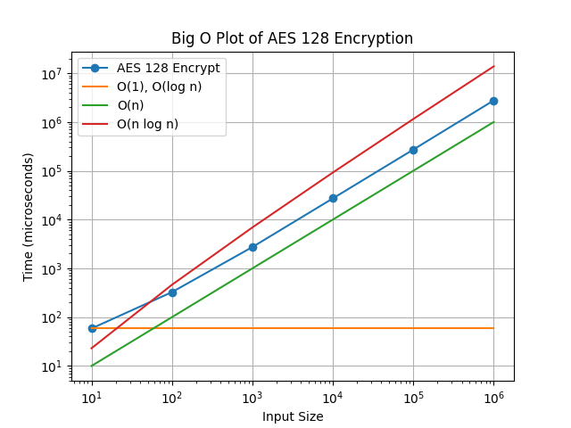

<meta name="viewport" content="width=device-width, initial-scale=1.0">

# Verschlüsselung: AES 128 bit

Gruppenarbeit von Rodrigo Zihlmann, Matthias Unternährer und Tuan Binh Tran

# Einleitung

Dieses Handout beschreibt unsere Lösung zur Python-Aufgabe "Verschlüsselung: AES". Im Handout sind unsere Funktionen und Tests zusammengefasst beschrieben. Unsere Gedanken haben wir ebenfalls in diesem Dokument festgehalten.

Die Ziele und Bewertungkriterien sind der Aufgabe "Übung II: Fortgeschrittene Algorithmen" zu entnehmen: https://github.com/fhirter/Software-Engineering/blob/master/ProgrammingBasicsAndAlgorithms/Exercises/Advanced/Tasks.md

# Ziele

- Fokus auf die 128-bit Variante von AES
- Fokus auf Encryption
- Code sollte möglichst wenig zusätzliche Librarys verwenden.
- Die Encryption liefert den verschlüsselten Text in Base64 zurück
- Bei Komplexeren Funktionen, wird die Logik vereinfacht und im Code beschrieben
- Optional: Decryption (wenn genügend Zeit vorhanden)

# Projektstruktur

Das Repository ist im Github unter folgendem Link zufinden: https://github.com/TIATIP-24-A-a/AES-TuBi-ZiRo-MaUn

# Funktionsweise unserer AES(128bit) Funktion

Unsere Funktion akzeptiert zwei String Parameter. Beim ersten Parameter handelt es sich um den `key`, welcher zum encrypten sowohl auch zum decrypten benötigt wird. Mit dem zweiten Parameter, `text` wird der zuverschlüsselte Text angegeben.\
Der `key` muss für unsere Funktion genau aus 16 bytes bestehen. Dieser wird validiert. Bei nicht bestandener Validierung wird eine Exception ausgegeben und bricht die Verschlüsselung ab. Der `text` kann in unserer Funktion eine beliebige Länge haben.\
Die beiden Parameter werden beim Start der Funktion in bytes und anschliessend in 4x4 Matrixen umgewandelt. Dieser schritt ist essenziell für die weiterführenden Operationen.

 
 

Die AES 128bit Verschlüsselung erfolgt in 10 Runden. Eine Runde setzt sich dabei aus mehreren Funktionen zusammen.

- Key Expansion
- Initial Runde
  - Add Round Key
- Restliche Runden
  - Sub Bytes
  - Shift Rows
  - Mix Columns
  - Add Round Key  

 

#### Add Round Key (Initial Runde):

In der ersten Runde wird, mithilfe des initial Key und einer XoR berechnung, der zu verschlüsselnde Text, welcher nun in Blöcke aufgeteilt ist neu geschrieben.

####  Sub Bytes:

Diese Funktion ersetzt die Bytes der Blöcke durch Werte aus der sogenannten S-Box(Substitutionsbox)

 
 
 
 
 

####  Shift Rows:

Nun verschiebt die Funktion die Werte in den jeweiligen Blöcken zeilenweise um eine gewisse Anzahl Spalten verschoben.
 
 
 
 

#### Mix Columns:

In diesem Schritt werden die einzelnen Spalten über ein Galois Feld (2^8) multipliziert.\
Ziel dieser Funktion ist, dass die Spalten vermischt werden.\
In der letzten Runde wird diese funktion nicht mehr ausgeführt.

> [!NOTE] Aufgrund der komplexität der mathematischen Berechnung haben wir dies in unserem Code stark vereinfacht.

####  Add Roundkey:

Hier wird nun jeder Block mithilfe des aktuellen Rundenschlüssel und einer XOR berechnung neu erstellt.

 
 
Nach beenden der Runden wird der Wert in einen für uns lesbareren Wert umgewandelt und ausgegeben. Dieser Text ist nun in verschlüsselter Form ersichtlich.
 
 

# Unit Tests

Die Unit-Tests wurde im TDD-Verfahren erstellt. Da AES aus verschiedenste Funktionen besteht, wurde diese geprüft.

Für die detaillierte Implementation siehe `AES_Test.py`.

# Komplexitätsanalyse

 Ergebnis gemäss Benchmark-Daten

| Input Size | Time (milliseconds) |
| ---------- | ------------------- |
| 10         | 0.058532            |
| 100        | 0.325612            |
| 1000       | 2.735687            |
| 10000      | 27.157852           |
| 100000     | 271.913340          |
| 1000000    | 2771.543940         |

# Erkenntnisse

- AES ist sehr komplex.
- Zusammenspiel von verschiedenen Algorithmen ist schwierig.
- Aufwändig den Code ohne zusätzlichen Librarys zu erstellen.

 
 
 

# Quellen

- AES: Step-by-Step In-Depth: https://medium.com/@dillihangrae/aes-advanced-encryption-standard-step-by-step-in-depth-understanding-62a9db709902
- AES: How to Design Secure Encryption: https://www.youtube.com/watch?v=C4ATDMIz5wc&pp=ygUDYWVz
- AES key schedule: https://en.wikipedia.org/wiki/AES_key_schedule
- AES Key Expansion Algorithm: https://www.tutorialspoint.com/cryptography/cryptography_aes_key_expansion_algorithm.htm
- The AES Key Schedule explained: https://braincoke.fr/blog/2020/08/the-aes-key-schedule-explained/#aes-key-schedule
- ChatGPT: https://chatgpt.com
- Sub Bytes, Shift Rows, Add Round Key Bilder: https://www.davidwong.fr/blockbreakers/aes_9_addroundkey.html
